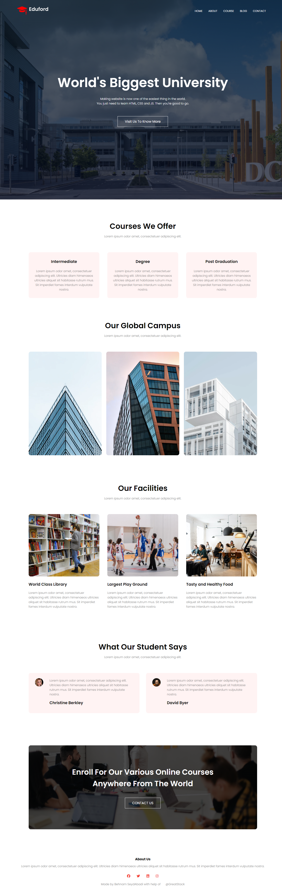

# University Presentation Website

Welcome to my University Presentation Website! This project is a practice exercise in HTML and CSS, designed to showcase my skills in web development. The website serves as a portfolio for my university presentations and includes various sections to highlight my work, projects, and academic achievements.

## Features

- **Responsive Design**: The website is designed to be fully responsive, ensuring a seamless experience on both desktop and mobile devices.
- **Clean Layout**: A simple and clean layout that focuses on content presentation.
- **Navigation**: Easy-to-use navigation menu for quick access to different sections of the website.
- **Styling**: Custom CSS styles to enhance the visual appeal of the website.

## Technologies Used

- HTML5
- CSS3

## Screen shots

